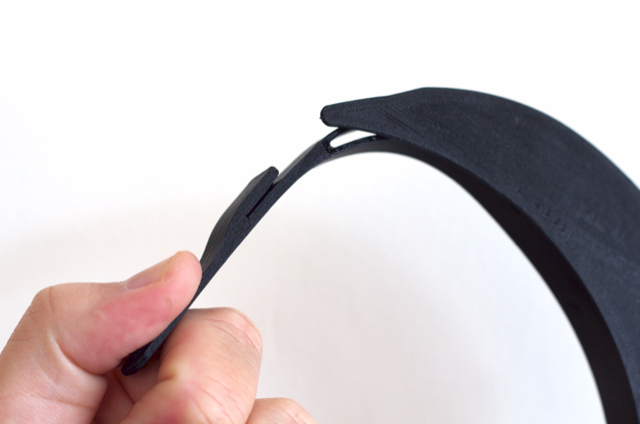
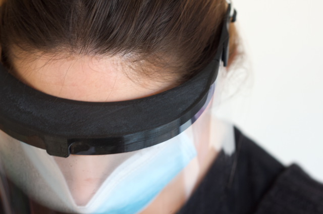
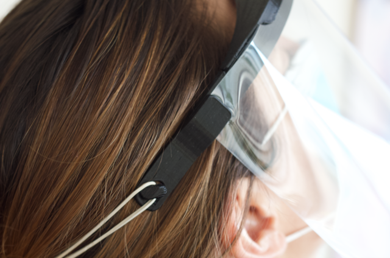
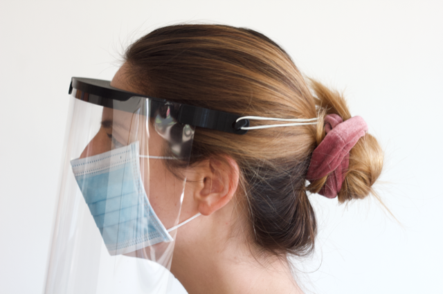

# Fablab U Chile Escudo Facial / Esto es un trabajo en progreso

English version [here](/README.md) | Versión en inglés [acá](/README.md)

### Tabla de contenidos
  * [Resumen](#resumen)
    + [Validación de seguridad y eficacia](#validaci-n-de-seguridad-y-eficacia)
  * [Versiones](#versiones)
      - [ÚLTIMA VERSIÓN -> V6.0](#-ltima-versi-n----v60)
      - [V5.0 (puede imprimirse en torre)](#v50--puede-imprimirse-en-torre-)
      - [V4.0](#v40)
      - [V3.0](#v30)
      - [V2.0](#v20)
      - [V1.0](#v10)
  * [Partes](#partes)
    + [Cintillo impreso en 3D](#cintillo-impreso-en-3d)
      - [Parámetros de impresión](#par-metros-de-impresi-n)
    + [Partes comerciales](#partes-comerciales)
      - [Mica tamaño carta u oficio](#mica-tama-o-carta-u-oficio)
      - [Banda elástica](#banda-el-stica)
  * [Ensamble](#ensamble)
  * [Recomendaciones de estrilización y seguridad](#recomendaciones-de-estrilizaci-n-y-seguridad)
  * [Únete a la comunidad](#-nete-a-la-comunidad)
  * [Licencia](#licencia)

<small><i><a href='http://ecotrust-canada.github.io/markdown-toc/'>Table of contents generated with markdown-toc</a></i></small>

## Resumen

Basado en la iniciativa [Prusa Face Shield](https://www.prusaprinters.org/prints/25857-protective-face-shield-rc3), diseñamos este escudo facial pensando en eliminar cualquier trabajo extra en las [partes comerciales](#partes-comerciales), disminuyendo la probabilidad de contaminación durante la fabricación y para que sea directamente ensamblable. El escudo facial está hecho para complementar el uso de la mascarilla N95 o similar.

### Validación de seguridad y eficacia

Recientemente, sometimos la versión V6.0 del Escudo Facial a pruebas de laboratorio ([LICTEX USACH](https://www.linkedin.com/company/lictex-udesantiago/?originalSubdomain=cl)) para validar la eficacia del Escudo Facial (*)(**). Las pruebas realizadas fueron:
1. Protección zonas protegidas punto norma 
2. Protección contra gotas y salpicaduras de líquidos
3. Evaluación de la protección lateral
4. Valorización Campo Visual.

(*)Estas pruebas son verificadas por el [Instituto de Salud Pública de Chile](http://www.ispch.cl/).

(**)Según la norma, para comercializar Escudos Faciales en Chile, se requiere una 5ta prueba, de empañamiento, pero en Chile no existen laboratorios que puedan realizar dicha prueba.

## Versiones

#### ÚLTIMA VERSIÓN -> V6.0

La nueva versión tiene mejoras en dirección a generar la mayor protección posible: 
* Se modifica la distancia del soporte para la mica, que hasta la versión 5 estaba pensada para una mica tamaño carta (~216 mm), en esta versión se modificó para utilizar una mica tamaño oficio en orientación horizontal (~330 mm).
* Se agrega una vicera que protege la cara del usuario de salpicaduras o partículas que puedan venir desde arriba.
* La vicera quita mucha flexibilidad y comodidad al escudo, por lo que se realizaron cortes entre la vicera y las patas laterales para que sea más cómodo y adaptable a distintos tamaños de cabeza.

#### V5.0 (puede imprimirse en torre)

La nueva versión de la máscara facial tiene mejoras que otorgan mayor comodidad en su uso: sus bandas laterales se abrieron hasta quedar casi paralelas para disminuir el malestar en las sienes que se generaba al utilizar mucho tiempo la máscara facial. Tiene una estructura un poco más robousta y se agregaron unos detalles para la impresión en pila (una sobre otra).

  

  

#### V4.0

En la versión 4.0 se hace un poco más resistente la pestaña del frente ya que algunos usuarios comentaron que era un poco frágil.

#### V3.0

La versión 3 tiene la parte de atrás del cintillo curva para entregar mayor comodidad.

#### V2.0

#### V1.0

## Partes

EL dispositivo está compuesto por 3 componentes:
* Cintillo impreso en 3D
* Lámina transparente de acetato de celulosa (mica tamaño carta (216x279mm)  u oficio (216x356mm))
* un elástico común

### Cintillo impreso en 3D

**PUEDES DESCARGAR EL .STL** en [PrusaPrinters](https://www.prusaprinters.org/prints/30347-fablab-u-de-chile-faceshield),  [Thingiverse](https://www.thingiverse.com/thing:4250678) o en [Grabcad](https://grabcad.com/library/covid-face-shield-2) (STEP and F3D). Por favor antes de descargar e imprimir, revisa el historial de versiones, recuerda que *este es un trabajo en progreso* por lo si encontramos mejoras a nuestro cintillo, iremos subiendo las diferentes versiones.

Versión | Nombre del archivo            | Fecha de liberación
------- | ---------------------------   | ------------
V6.0	| face_shield_fabuchile_v6.stl	| 27-07
V5.0    | face_shield_fabuchile_v5.stl  | 22-04
V4.0    | faceshield_fablab_uch_v4.stl  | 06-04
V3.0	| faceshield_fablab_uch_v3.stl	| 02-04
V2.0    | faceshield_fablab_uch_v2.stl  | 31-03
V1.0    | FaceShield_FabLab_UCH.stl     | 30-03

Recomendamos impirmir el cintillo en PLA, pues es más fácil de imprimir, tiene una baja huella de carbono, es compostable y es suficientemente resistente. Es factible utilizar para la impresión otro filamento más resistente, como ABS o PETG, mientras sea compatible con los procesos de sanitización necesarios para la esterilización de la pieza impresa en 3D.

El cintillo consiste en dos bandas de diferente largo unidas en sus extremos. La banda interior rodea la cabeza, mientras que la externa sostiene la lámina transparente mediante ajustes a presión, distanciandola de la cara para dar espacio a lentes y antiparras, también para evitar el empañamiento de la lámina por la respiración. En sus puntas posee ganchos para afirmarse el cintillo a la cabeza mediante un elástico u otro sistema que les acomode.

#### Parámetros de impresión

versión 5 en la cama de software Cura, la solapa frontal mira hacia arriba, al igual que los ganchos de la parte de atrás del cintillo.

Usamos impresoras Ender 3 y Ender 5 para probar los modelos, y Cura como slicer, usando los siguientes parámetros:

- Material: PLA
- Temperatura de extrusión: 200°C
- Temperatura de cama: 60°C
- Altura de capa: 0.3 mm
- Número de Shells: 3
- Densidad de infills: 0% - 10% (casi puros muros, puede ser 0%)
- Velocidad: 60 mm/s infill, 30 mm/s shells.

Se pueden imprimir varios cintillos al mismo tiempo, dependiendo del tamaño de la cama de tu impresora.

La única parte compleja de esta pieza son los calces para afirmar el plástico transparente al cintillo, está optimizado para ser impreso con una boquilla de 0.4 mm. Tienen que asegurarse que esta parte se imprima correctamente para que funcione el cintillo.

### Partes comerciales

#### Mica tamaño carta u oficio

La lámina de mica es tamaño carta (216X279 mm) u oficio (216x356 mm), de 0.2 mm de espesor, está disponible en la mayoría de librerías o tiendas de artículos escolares. Es posible utilizar una lámina transparente de otro material si es que están disponibles en el mismo tamaño y son compatibles con los procesos de sanitización que se llevarán a cabo. También se puede utilizar como escudo el plástico de una botella de 2 litros recortada, si no tienes otro material a disposición.

#### Banda elástica

 Es posible usar cualquier banda elástica que permita que el dispositivo se sienta cómo y firme, nosotros usamos el [elástico más común](https://www.aliexpress.com/i/32900926065.html) que entrega comodidad y seguridad al usar el escudo.

## Ensamble

Después de la impresión y la sanitización de las partes, la lámina transparente se introduce en las pestañas de ajuste a presión en la banda exterior del cintillo, como se muestra en la imágen más abajo. Luego, la banda elástica se pone en los ganchos en las puntas del cintillo. Para asegurar que la lámina está firme, tírala suavemente hacia afuera. Que la lámina quede bien ajustada es crítico para el funcionamiento del dispositivo y la seguridad del usuario.

1. Pon una de las esquinas superiores de la mica en una de las solapas laterales

2. Engancha la parte del medio de la mica en la solapa frontal

3. Pon la otra esquina superior de la mica en la solapa del otro lado

4. Engancha la banda elástica en los ganchos posteriores

## Recomendaciones de estrilización y seguridad

Durante todo el proceso debes actuar como si estuvieras contaminado con el virus Covid-19, debes imprimir las piezas en ambiente limpio y al manipularlas debes usar en todo momento guantes, mascarilla y un escudo facial limpios para prevenir la contaminación.

Una vez impresa la pieza, debes esperar que se enfríe y almacenarla en una bolsa plástica. [Estudios recientes](https://www.nejm.org/doi/full/10.1056/NEJMc2004973?query=featured_home) muestran que el virus puede subsistir hasta 90 horas en las superficies plásticas, por lo que se sugiere almacenar las piezas entre **tres o cuatro días** antes de ser entregadas, a menos que se tomen los resguardos y protocolos higiénicos adecuados en el lugar donde las envías.

En [AFES Chile](http://afeschile.cl) estamos centralizando los pedidos de escudos faciales de los centros hospitalarios que las requieran, así como la producción y sanitización de estos. Si quieres ayudar y no puedes cumplir las condiciones necesarias de sanidad, inscrítbete como fabricante en la [página](http://afeschile.cl) para que tu producción pueda ser sanitizada correctamente antes de ser entregada a los equipos médicos.

Puedes encontrar más información acerca de este proyecto en el siguiente [documento](/docs/LaminaFaceShield.pdf) o en la página de AFES Chile.

## Únete a la comunidad

Debido a la contingencia del coronavirus, se necesita más ayuda que nunca de los makers y entusiastas de la fabricación digital, por lo que te invitamos a fabricar protectores faciales y otros insumos que pueden ser requeridos por los equipos médicos en las próximas semanas, siguiendo las medidas sanitarias correspondientes. Si no puedes fabricar, puedes correr la voz para que el llamado llegue a todos.

Si crees que este modelo puede mejorar, tenemos disponibles los archivos CAD para Fusion 360 o STEP en [este enlace][last-version]. Puedes hacer modificaciones y enviarnosla para revisarla y publicarla en nuestras redes si pasa la prueba de calidad. Somos enfáticos en que **seas serio** al imprimir y repartir este tipo de insumos impresos en 3D y que cumplas todas las medidas de seguridad recomendadas.

Pueden encontrarnos en [facebook](https://www.facebook.com/fablabudechile/), [instagram](www.instagram.com/fablabudechile) o revisar nuestra [página web](www.fablab.uchile.cl) para conocer nuestros proyectos.

[last-version]: https://github.com/FabLabUChile/fabuchile-face-shield/tree/master/cad/v5

## Licencia

Shield: [![CC BY 4.0][cc-by-sa-shield]][cc-by-sa]

Este trabajo está licenciado bajo la licencia [Creative Commons Attribution 4.0 International
License][cc-by-sa].

[![CC BY SA 4.0][cc-by-sa-image]][cc-by-sa]

[cc-by-sa]: https://creativecommons.org/licenses/by-sa/4.0/
[cc-by-sa-image]: https://i.creativecommons.org/l/by-sa/4.0/88x31.png
[cc-by-sa-shield]: https://img.shields.io/badge/License-CC%20BY%20SA%204.0-lightgrey.svg

